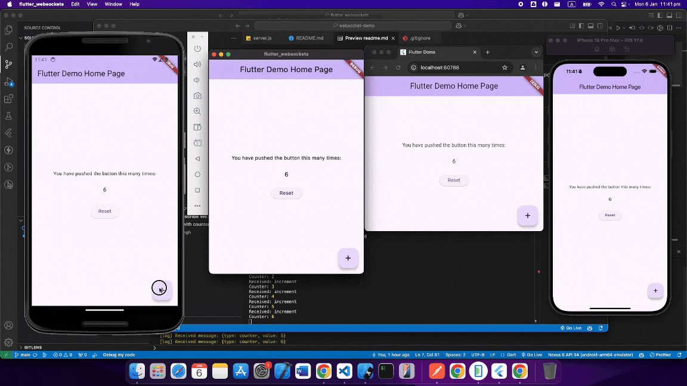

# WebSocket Demo
This is a simple counter WebSocket server that broadcasts counter updates to all connected clients.
The counter value is updated whenever a message is received from any single client.

## Flutter Client

You can find the Flutter client for this project [here](https://github.com/0xharkirat/flutter_websockets).



## Instructions to Run Locally

1. Clone the repository:
    ```bash
    git clone https://github.com/yourusername/websocket-demo.git
    ```
2. Navigate to the project directory:
    ```bash
    cd websocket-demo
    ```
3. Install the dependencies:
    ```bash
    npm install
    ```
4. Start the server:
    ```bash
    node server.js
    ```
5. Open the Flutter client and run it on your desired device.

Make sure you have Node installed and set up on your machine.
